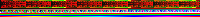
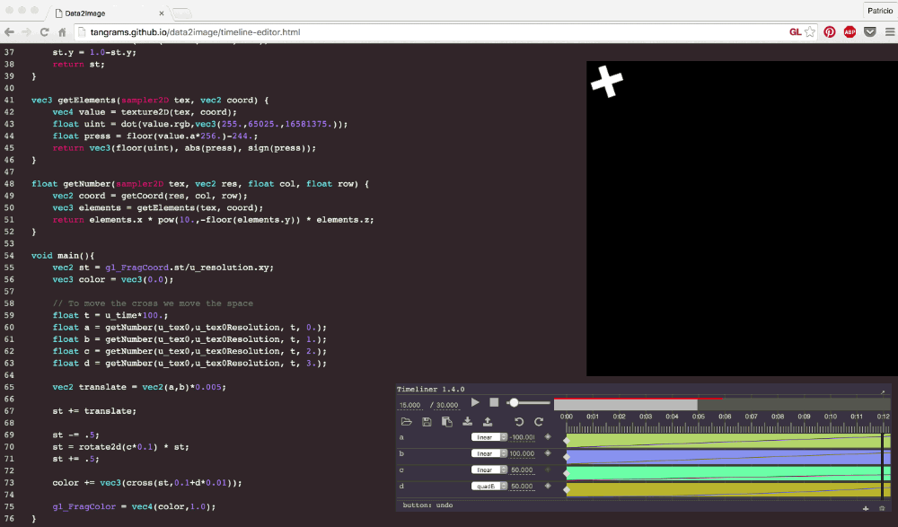

## Data2Image

Experimental tool to encode data into color. How? Define elements, their ```type``` and a ```function``` of how to populate it's content. Then provide how many instances of those elements you want.

```js
var data = new Data2Image();
var instances = 200;
data.setTotalInstances(instances);
data.addElement('negative_integerx100','number', (instance, element) => {
    return -instance*100;
});
data.addElement('negative_integerx10','number', (instance, element) => {
    return -instance*10;
});
data.addElement('negative_integer','number', (instance, element) => {
    return -instance;
});
data.addElement('float','number', (instance, element) => {
    return instance/instances;
});
data.addElement('integer','number', (instance, element) => {
    return instance;
});
data.addElement('integerx5','number', (instance, element) => {
    return instance*5;
});
data.addElement('integerx10','number', (instance, element) => {
    return instance*10;
});
data.addElement('integerx100','number', (instance, element) => {
    return instance*100;
});

// Get the URL of the image
var url = data.getUrl();
// or a DOM with the image preloaded
var img = data.getImg(); 
```

This construct a database of rows and columns which values are store as color. This colors are store as an image that if you streach looks like this:


Then the values can be recover inside a GLSL shader using the following code:

```glsl
vec2 getCoord(vec2 res, float col, float row) {
    vec2 st = fract(vec2(col+.5,row+.5)/res);
    st.y = 1.0-st.y;
    return st;
}

vec3 getElements(sampler2D tex, vec2 coord) {
    vec4 value = texture2D(tex, coord);
    float uint = dot(value.rgb,vec3(255.,65025.,16581375.));
    float press = floor(value.a*256.)-244.;
    return vec3(floor(uint), abs(press), sign(press));
}

float getNumber(sampler2D tex, vec2 res, float col, float row) {
    vec2 coord = getCoord(res, col, row);
    vec3 elements = getElements(tex, coord);
    return elements.x * pow(10.,-floor(elements.y)) * elements.z;
}
```


```Data2Image()``` also support other data types such as ```color``` and 2D ```positions```. Also it's posible to force a numeric type into ```int```, ```unint```, ```float``` and ```ufloat```.

```js
...
data.addElement('unsigned_integer','uint', (instance, element) => {
    return instance;
});
data.addElement('signed_integer','int', (instance, element) => {
    return instance;
});
data.addElement('unsigned_float','ufloat', (instance, element) => {
    return instance/instances;
});
data.addElement('signed_float','float', (instance, element) => {
    return instance/instances;
});
data.addElement('position','position', (instance, element) => {
    return [Math.sin((instance/instances)*3.1415),Math.cos((instance/instances)*3.1415)];
});
data.addElement('red','color', (instance, element) => {
    return [255,0,0];
});
data.addElement('green','color', (instance, element) => {
    return [0,255,0];
});
data.addElement('blue','color', (instance, element) => {
    return [0,0,255];
});
data.addElement('HUE','color', (instance, element) => {
    return hslToRgb(instance/instances,1,.5);
});
...
```

<a href="http://tangrams.github.io/data2image/display.html"></a>

### What's special about this?

Well, this is just a way to pass a big amounts of data to the GPU and use it inside a GLSL Shader. Image all you can do with it. For example you can feed the ```Data2Image()``` with the content of a timeline editor (like [Joshua Koo](https://twitter.com/blurspline)'s [Timeliner](https://github.com/zz85/timeliner)) and edit with presition your animations.

[](http://tangrams.github.io/data2image/timeline-editor.html)

Interesting right? Try [this editor](http://tangrams.github.io/data2image/editor.html), [this timeline](http://tangrams.github.io/data2image/timeline.html) or [both](http://tangrams.github.io/data2image/timeline-editor.html).

## Author

**Patricio Gonzalez Vivo** (Buenos Aires, 1982) is a New York based artist and engineer. He explores interstitial spaces between organic and synthetic, analog and digital, individual and collective.

Patricio studied and practiced psychotherapy and expressive art therapy. He holds an MFA in Design & Technology from Parsons The New School, where he now teaches. Currently he works as a Graphic Engineer at Mapzen making open-source mapping tools.

## Thanks to

* [Jaume Sanchez Elias](https://www.clicktorelease.com/) for helping me with the premultiply alpha problem
* [Bei ZHANG](http://twbs.in/) for [rasterjs](https://bitbucket.org/bzhang/rasterjs) used to encode the binary data
